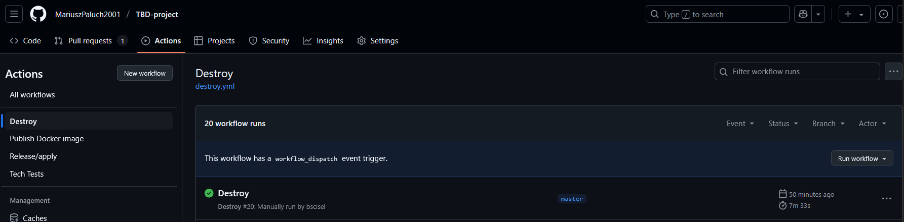
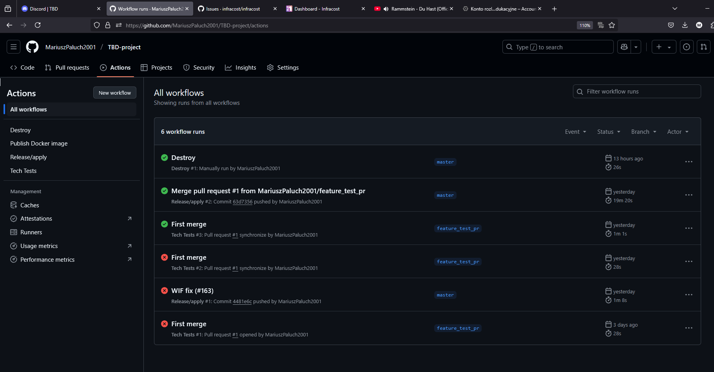
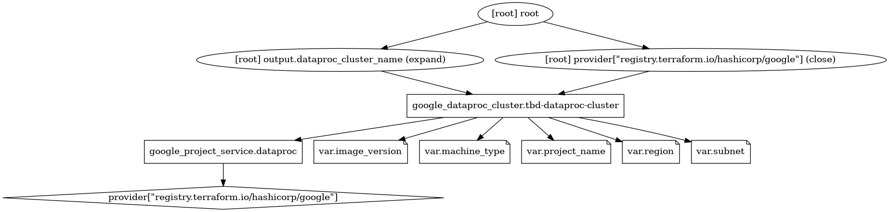
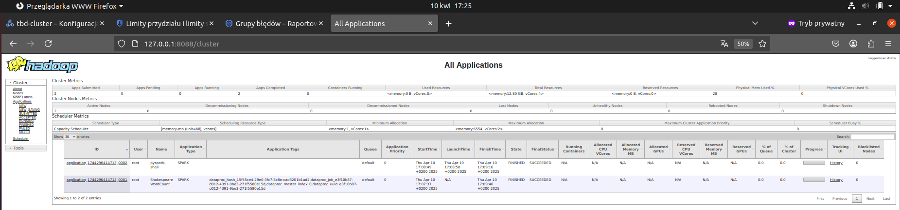
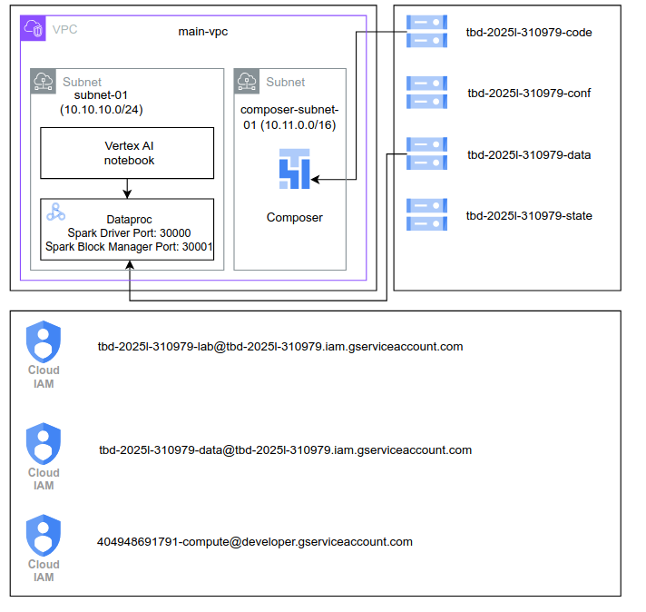
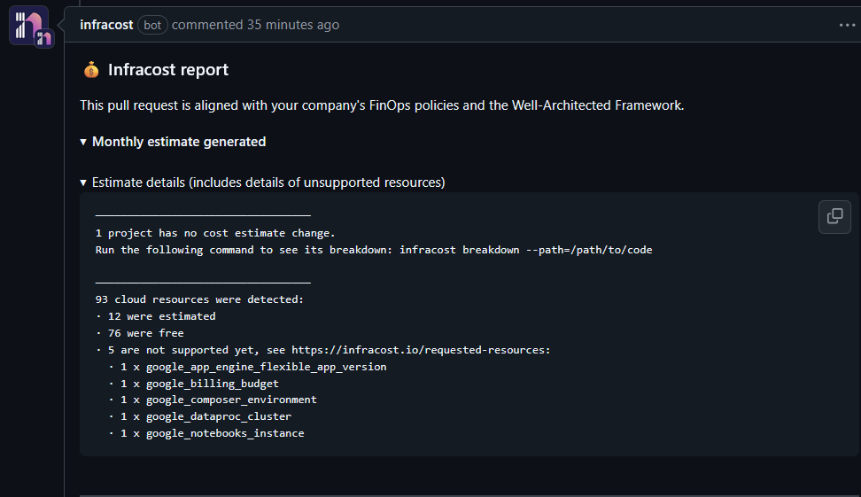
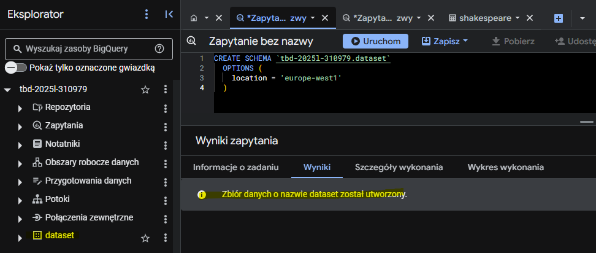
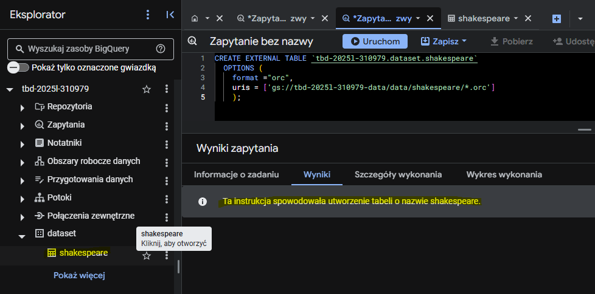
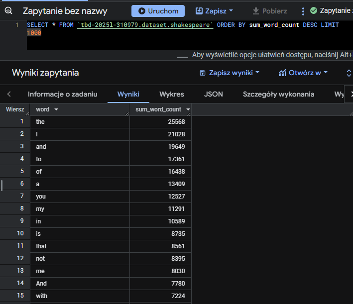

IMPORTANT ❗ ❗ ❗ Please remember to destroy all the resources after each work session. You can recreate infrastructure by creating new PR and merging it to master.
  


1. Authors:

   - Mariusz Paluch (LIDER) - 310866
   - Jakub Winter - 310979
   - Barłomiej Ściseł - 310953

   Link to forked repo: [https://github.com/MariuszPaluch2001/TBD-project](https://github.com/MariuszPaluch2001/TBD-project)
   
2. Follow all steps in README.md.

3. In boostrap/variables.tf add your emails to variable "budget_channels".
    ```tf
    variable "budget_channels" {
    type        = map(string)
    description = "Budget notification channels"
    default = {
        marek-wiewiorka : "marek.wiewiorka@gmail.com",
        mariusz-paluch : "mariusz.paluch2001@gmail.com",
        bartlomiej-scisel : "vermish9@gmail.com",
        jakub-winter : "jakubwinter01@gmail.com",
    }
    }
    ```
4. From avaialble Github Actions select and run destroy on main branch.
    
   
5. Create new git branch and:
    1. Modify tasks-phase1.md file.
    
    2. Create PR from this branch to **YOUR** master and merge it to make new release. 
    


6. Analyze terraform code. Play with terraform plan, terraform graph to investigate different modules.


    Module Dataproc: 
    ```bash
    terraform graph -type=plan | dot -Tpng >graph_plan.png # generate plan graph
    terraform graph | dot -Tpng >graph_plan.png # generate dataproc graph
    ```
    
    

    Google Dataproc is a service offered by Google in a PaaS model. Dataproc is a fully managed and scalable service for running Apache Hadoop, Apache Spark, Apache Flink, Presto, and other open source tools and frameworks. There is a cluster associated with the Dataproc service, whose configuration is stored using the terraform code. The creation and use of Google Dataproc is therefore very simple, just specify the cluster and use the ready-to-use service.
   
7. Reach YARN UI
   ```bash
   gcloud compute ssh tbd-cluster-m --zone "europe-west1-c" --tunnel-through-iap --project "tbd-2025l-310979" -- -L 8088:localhost:8088 
    ```
    

   
8. Draw an architecture diagram (e.g. in draw.io) that includes:
    1. VPC topology with service assignment to subnets
    2. Description of the components of service accounts
    3. List of buckets for disposal
    4. Description of network communication (ports, why it is necessary to specify the host for the driver) of Apache Spark running from Vertex AI Workbech
  
    

9. Create a new PR and add costs by entering the expected consumption into Infracost
For all the resources of type: `google_artifact_registry`, `google_storage_bucket`, `google_service_networking_connection`
create a sample usage profiles and add it to the Infracost task in CI/CD pipeline. Usage file [example](https://github.com/infracost/infracost/blob/master/infracost-usage-example.yml) 
 ```yaml
    version: 0.1
    resource_usage:
    google_artifact_registry_repository.registry:
        storage_gb: 50 # Total data stored in the repository in GB
    google_storage_bucket.tbd_data_bucket:
        storage_gb: 150                   # Total size of bucket in GB.
        monthly_class_a_operations: 4000 # Monthly number of class A operations (object adds, bucket/object list).
        monthly_class_b_operations: 2000 # Monthly number of class B operations (object gets, retrieve bucket/object metadata).
        monthly_egress_data_transfer_gb:  # Monthly data transfer from Cloud Storage to the following, in GB:
        same_continent: 40  # Same continent.
        worldwide: 40     # Worldwide excluding Asia, Australia.
        asia: 10           # Asia excluding China, but including Hong Kong.
        china: 10            # China excluding Hong Kong.
        australia: 10       # Australia.
    google_storage_bucket.tbd_code_bucket:
        storage_gb: 100
        monthly_class_a_operations: 1000
        monthly_class_b_operations: 500
        monthly_egress_data_transfer_gb: 100
    google_service_networking_connection.my_connection:
        monthly_egress_data_transfer_gb:  250
  ```


10. Create a BigQuery dataset and an external table using SQL

    ```sql
    CREATE SCHEMA `tbd-2025l-310979.dataset`
      OPTIONS (
        location = 'europe-west1'
      )
    ```
    

    ```sql
    CREATE EXTERNAL TABLE `tbd-2025l-310979.dataset.shakespeare`
      OPTIONS (
        format ="orc",
        uris = ['gs://tbd-2025l-310979-data/data/shakespeare/*.orc']
      );
    ```
    
    
   
    ### Why does ORC not require a table schema?

    ORC doesn’t need a table schema because it saves the schema inside the file itself. So when you read an ORC file, it already knows what the data looks like: column names, types, etc.

    ### Other

    To create the external table, it was necessary to fix the `spark-job.py` from the next task, as creating this table requires data along with the format (the ORC data format includes this).

11. Find and correct the error in spark-job.py

    The issue was an incorrect path to the bucket where the processed data was supposed to be saved. The correct bucket path was provided, and the problem was resolved.
    It could have been found in the line:  
    ```
    DATA_BUCKET = "gs://tbd-2025l-9900-data/data/shakespeare/"
    ```

12. Add support for preemptible/spot instances in a Dataproc cluster

    [main.tf](https://github.com/MariuszPaluch2001/TBD-project/tree/master/modules/dataproc/main.tf)

    ```
    preemptible_worker_config {
        num_instances = var.spot_worker_count
        disk_config {
        boot_disk_type    = "pd-standard"
        boot_disk_size_gb = 100
        }

        preemptibility = "SPOT"
    }
    ```

    [variables.tf](https://github.com/MariuszPaluch2001/TBD-project/tree/master/modules/dataproc/variables.tf)
    ```
    variable "spot_worker_count" {
        type        = number
        default     = 0
        description = "Spot worker nodes count"
    }
    ```

    A variable `spot_worker_count` was created with a default value of 0. If a value greater than 0 is set, we can launch spot instances of virtual machines.
